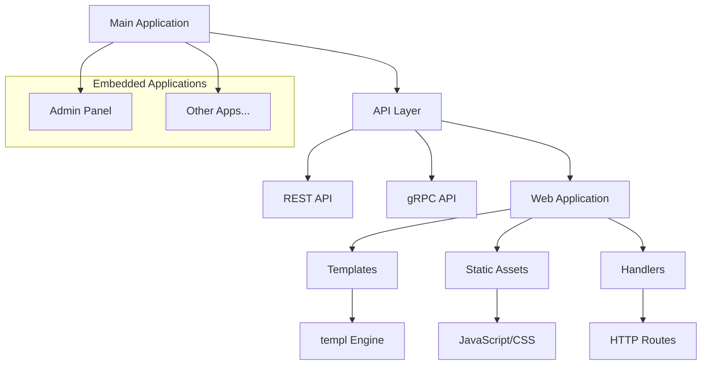
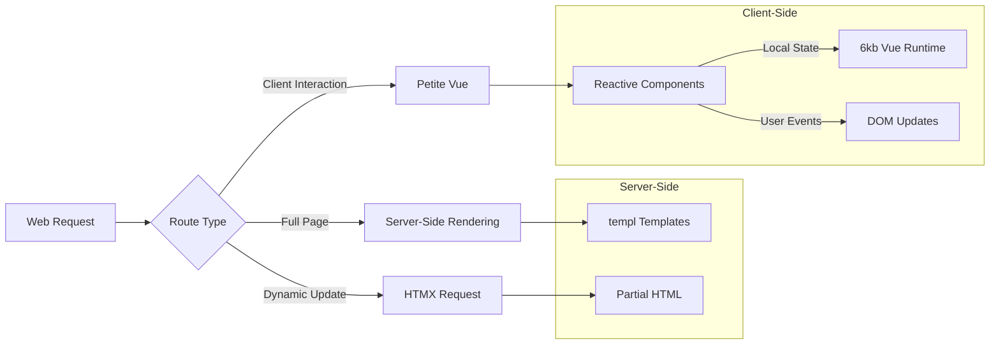

# WebStack

A comprehensive Go-based web application framework that combines server-side rendering, client-side reactivity, and API services (REST/gRPC) in a single cohesive stack.

## Features

- **Multi-Protocol Support**
  - REST API Server (`/api/rest`)
  - gRPC Server (`/api/rpc`)
  - Web Application Server (`/api/web`)

- **Web Stack**
  - Server-Side Rendering with [templ](https://templ.guide/)
  - Enhanced interactivity with [HTMX](https://htmx.org/)
  - Lightweight client-side reactivity using [Petite Vue](https://github.com/vuejs/petite-vue) (6kb)

- **Embedable Applications**
  - Utilize Go's `embed` feature for serving static assets
  - Support for multiple web applications (e.g., main app, admin panel)

## Architecture



## Rendering Strategy



## Project Structure

```
webstack/
├── api/
│   ├── rest/    # REST API server
│   ├── rpc/     # gRPC server
│   ├── web/     # Main web application
│   └── admin/   # Admin panel (example additional web app)
```

## Quick Start

1. Clone the repository

2. Install dependencies:
   ```bash
   make setup
   ```
   This will install both Go and Node.js dependencies.

3. Build and run:
   ```bash
   # Build the application
   make build

   # Run the application
   make run
   ```

4. Development mode:
   ```bash
   # Watch JavaScript changes
   make js-watch

   # Run the application
   make run
   ```

## Documentation

For detailed development instructions and guidelines, see [COPILOT-INSTRUCTIONS.md](./.github/copilot-instructions.md).

## License

[Apache 2.0](./LICENSE)
